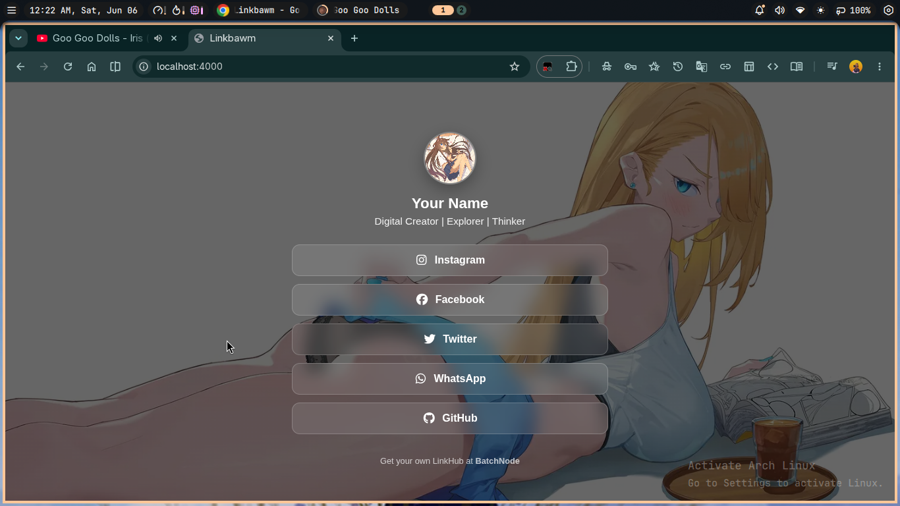
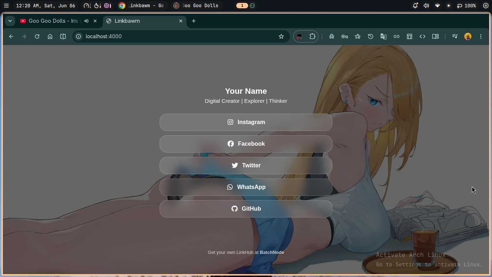
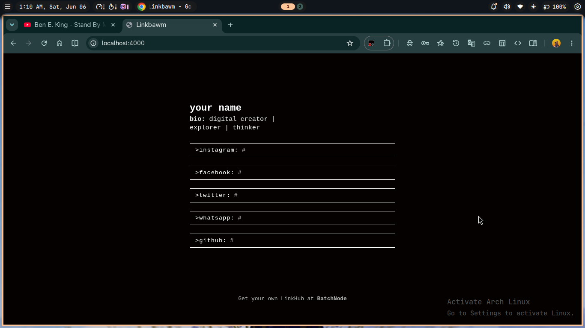
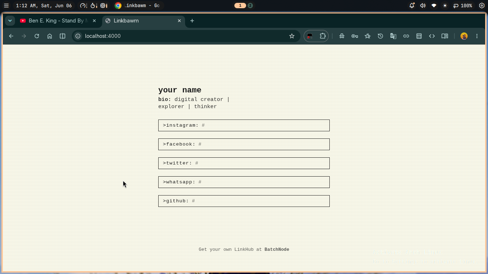
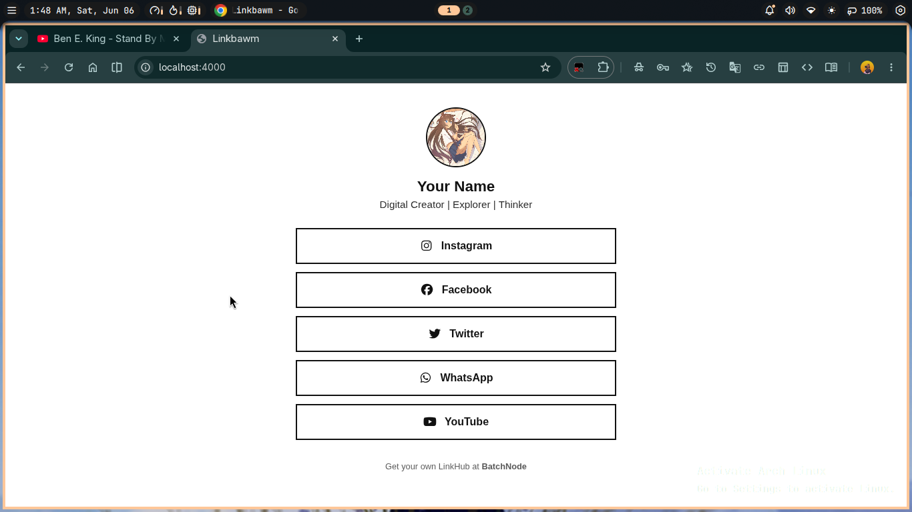
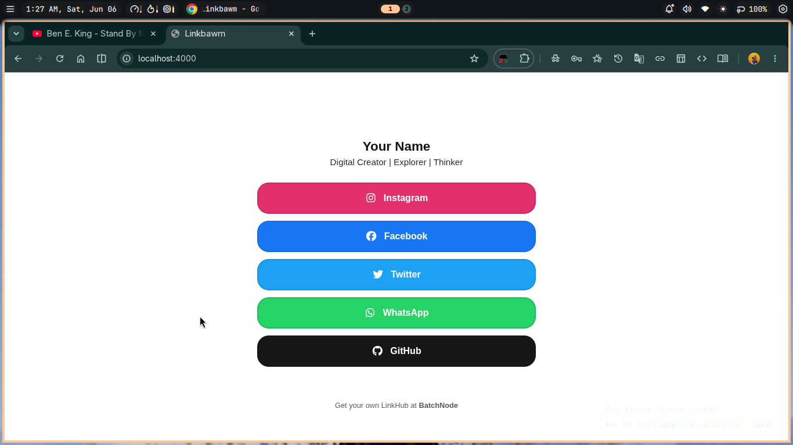
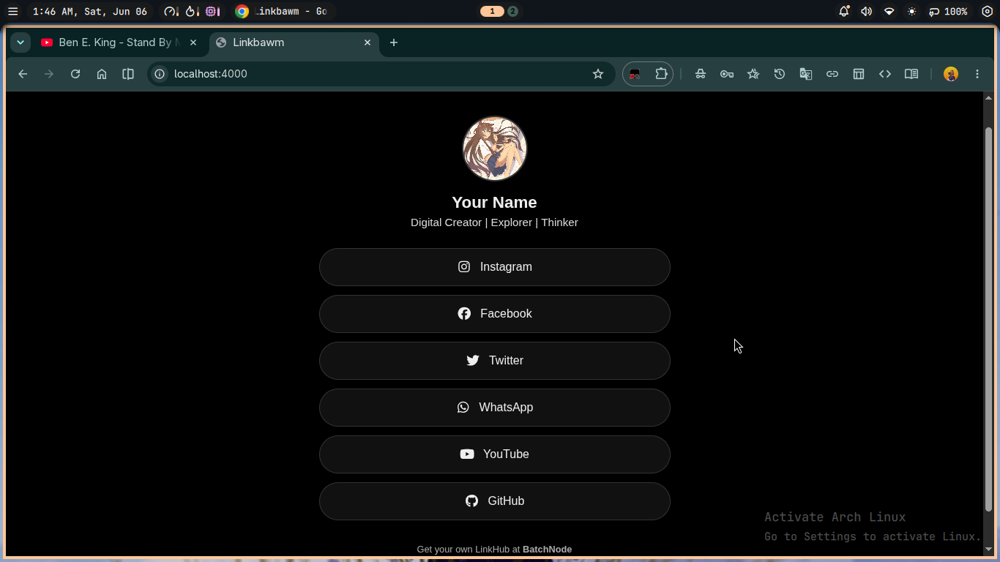
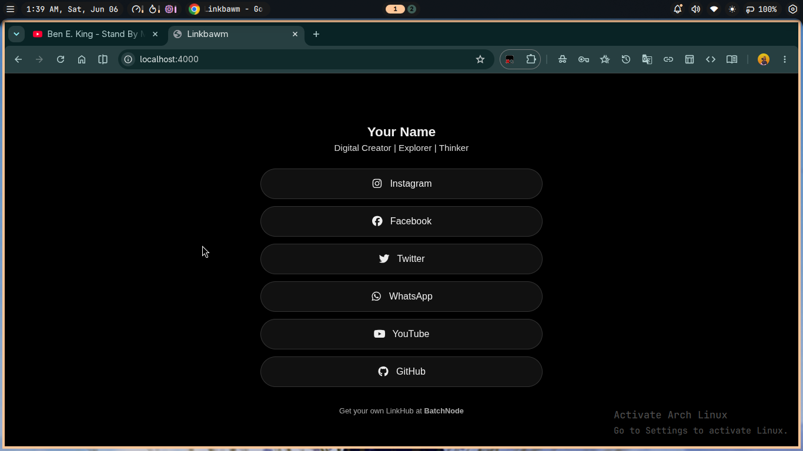

# Linkbawm

A modern, high-performance, and foolproof LinkHub (Linktree alternative) built with Jekyll.

> **Note for Users:** Linkbawm was created as a simple, easy-to-use template for non-technical users who want to own their link hub without the complexity of modern web frameworks. 
> 
> **Disclaimer:** This project is in its early stages. While it is functional, testing has not been exhaustive and you may encounter bugs. If you find an issue, feel free to report it via my [GitHub](https://github.com/thingpuisenhang), [Twitter](https://x.com/thingpuisenhang), or [Instagram](https://instagram.com/khomchunisien), open an issue on GitHub, or contribute a fix!

## Features
- **Zero-Code Content:** Manage your links entirely via `_data/links.yml`.
- **Identity Control:** Customize your name, bio, and avatar in `_config.yml`.
- **Responsive Backgrounds:** Intelligent switching between landscape and portrait background images.
- **Dynamic Assets:** Automatically generates a favicon using the first letter of your name and sets your name as the site title.
- **Glassmorphism:** Modern "Glass" skin with frosted-blur effects.
- **Terminal Mode:** A retro hacker skin for a unique look.
- **Max Link Guard:** Automatically enforces a 5-link limit (configurable) to keep your page professional.

## Skins and Features

### 1. Glass (Modern and Visual)
The Glass skin is the flagship Linkbawm theme. It uses modern Glassmorphism (frosted-blur) to create a high-end, aesthetic link hub that feels like a premium mobile app.

**Key Features:**
- **Double-Layer Background:** Uses separate landscape and portrait images for a perfect fit on any device.
- **Dynamic Blur:** Frosted glass effect that pulls colors from your background image.
- **Avatar Support:** Showcases your profile picture with customizable shapes and borders.

#### Glass: Default Look
The default "BatchNode Certified" look features a clean circle avatar, subtle 12px rounded corners, and Slate-toned transparency.


#### Glass: Personalized
With personalization enabled, you can overhaul the entire aesthetic. In the example below, we've disabled the avatar and pushed the roundness to 20px for a softer, more modern card look.


**Advanced Customization options for Glass:**
- **Borders:** Control avatar and card border sizes/colors independently.
- **Shapes:** Set avatar to circle, square, or rounded.
- **Native Colors:** Use native_colors: true to instantly paint links in their brand colors.
- **Opacity:** Fine-tune the background tint with background_overlay_opacity.

---

### 2. Terminal (Retro and Technical)
The Terminal skin is designed for those who want a raw, code-centric identity. It strips away all images and focusing entirely on text and retro CRT effects.

**Key Features:**
- **CRT Simulation:** Built-in animated scanlines and phosphor text-glow.
- **Technical Format:** Automatically displays links in a platform: url format.
- **Pure Text:** No avatars or background images, ensuring 100% focus on content.

#### Terminal: Standard Default
The "Certified" default is a crisp, high-contrast White-on-Black theme with 2px scanlines.


#### Terminal: Mainframe Mode
By enabling personalization, you can switch to the "Mainframe" look, which provides a professional "Typewriter on Ivory" aesthetic.


**Customization modes for Terminal:**
- **hacker:** The classic Matrix Green-on-Black look.
- **hacker-inverted:** High-energy Black-on-Green.
- **amber:** The nostalgic "Fallout" Orange-on-Dark Brown.
- **default:** The modern Charcoal-on-Ivory "Mainframe" look.

---

### 3. Paper (Clean and Professional)
The Paper skin is designed for professional portfolios, academic links, and minimalists. It focuses on a crisp, high-contrast light mode with sharp borders.

#### Paper: Default Look
A clean white background with bold black borders and circular avatar.


#### Paper: Personalized
Personalization hides the avatar, enables native brand colors, and softens the edges with a 20px radius.


---

### 4. Midnight (Sleek and OLED)
The Midnight skin is the ultimate dark theme. It uses true OLED black and smooth pill-shaped buttons for a sophisticated, futuristic feel.

#### Midnight: Default Look
Sleek dark gray pills with an inverted hover effect on a deep black base.


#### Midnight: Personalized
Hides the avatar and brings the page to life with vibrant native platform colors and full-pill shapes.


---

### Background Image Requirement (Glass Skin Only)
If you use the Glass skin, you MUST provide two images in assets/images/:
1.  **Landscape (background_image):** For desktops.
2.  **Portrait (background_portrait):** For mobile phones. Standard landscape images often look "zoomed-in" or blurry when cropped to a vertical phone screen. Providing a dedicated portrait image ensures high quality across all devices.

---

## Configuration

### 1. Your Profile (_config.yml)
- **Name:** Your display name (Max 4 words rendered).
- **Bio:** Your short tagline (Max 15 words rendered).
- **Skin:** Choose between "glass", "terminal", "paper", and "midnight".
- **Link Order:** 
    - "top": Shows links as they appear in links.yml.
    - "bottom": Reverses the order.
    - "random": Shuffles links on every visit.
    - "custom": Enables advanced control via priority.yml.

### 2. Managing Your Links (_data/links.yml)
Add your links here. Note that only the first 5 will show in "snug" mode unless you increase the limit.
```yaml
- label: "My Portfolio"
  url: "https://example.com"
  platform: "portfolio"
```

### 3. Advanced: Custom Order and Hiding Links (_data/priority.yml)
When link_order: "custom" is enabled in your config, this file becomes your master controller:

- **To Show/Reorder:** Assign a number to the platform. The order in this file determines the order on your site.
  ```yaml
  facebook: 1
  instagram: 2
  ```
- **To Hide a Link:** Either remove the platform from this file or leave the value blank.
  ```yaml
  tiktok:  # This will be HIDDEN even if it exists in links.yml
  ```
- **Max Links Bypass:** In "custom" mode, the global max_links setting is ignored. If you list 10 links here with numbers, all 10 will show.

---

## Deployment
1. **Fork** this repository.
2. Go to **Settings > Pages** and enable deployment from the master branch.
3. Your site will be live at https://yourusername.github.io/.

Built with love by [BatchNode](https://batchnode.onrender.com).
